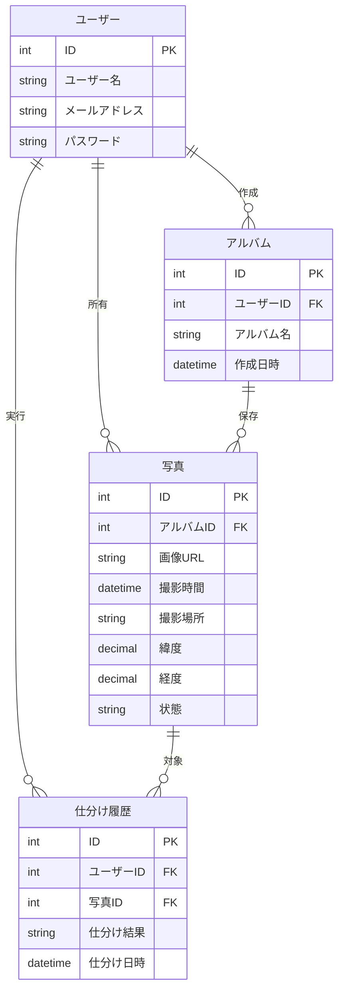

```mermaid
erDiagram

    ユーザー ||--o{ アルバム : 作成
    ユーザー ||--o{ 写真 : 所有
    ユーザー ||--o{ 仕分け履歴 : 実行
    アルバム ||--o{ 写真 : 保存
    写真 ||--o{ 仕分け履歴 : 対象

    ユーザー {
        int ID PK
        string ユーザー名
        string メールアドレス
        string パスワード
    }

    アルバム {
        int ID PK
        int ユーザーID FK
        string アルバム名
        datetime 作成日時
    }

    写真 {
        int ID PK
        int アルバムID FK
        string 画像URL
        datetime 撮影時間
        string 撮影場所
        decimal 緯度
        decimal 経度
        string 状態
    }

    仕分け履歴 {
        int ID PK
        int ユーザーID FK
        int 写真ID FK
        string 仕分け結果
        datetime 仕分け日時
    }
```
