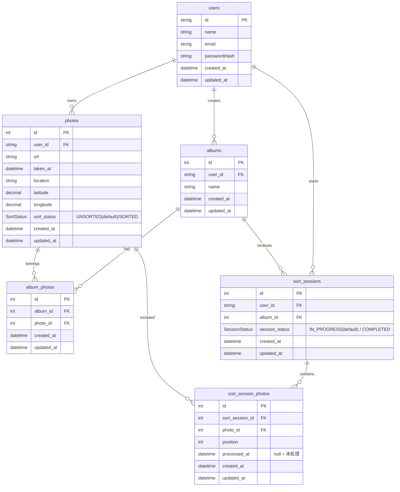

```mermaid
erDiagram

    users ||--o{ albums : creates
    users ||--o{ photos : owns
    albums ||--o{ album_photos : has
    photos ||--o{ album_photos : belongs
    users ||--o{ sort_sessions : starts
    albums ||--o{ sort_sessions : receives
    sort_sessions ||--o{ sort_session_photos : contains
    photos ||--o{ sort_session_photos : included

    users {
        string id PK
        string name
        string email
        string passwordHash
        datetime created_at
        datetime updated_at
    }

    albums {
        int id PK
        string user_id FK
        string name
        datetime created_at
        datetime updated_at
    }

    photos {
        int id PK
        string user_id FK
        string url
        datetime taken_at
        string location
        decimal latitude
        decimal longitude
        SortStatus sort_status "UNSORTED(default)/SORTED"
        datetime created_at
        datetime updated_at
    }

    album_photos {
        int id PK
        int album_id FK
        int photo_id FK
        datetime created_at
        datetime updated_at
    }

    sort_sessions {
        int id PK
        string user_id FK
        int album_id FK
        SessionStatus session_status "IN_PROGRESS(default) / COMPLETED"
        datetime created_at
        datetime updated_at
    }

    sort_session_photos {
        int id PK
        int sort_session_id FK
        int photo_id FK
        int position
        datetime processed_at "null = 未処理"
        datetime created_at
        datetime updated_at
    }

```

### 制約

- sort_session_photos：sort_session_id と photo_id の組み合わせは一意
- sort_session_photos：sort_session_id と position の組み合わせは一意
